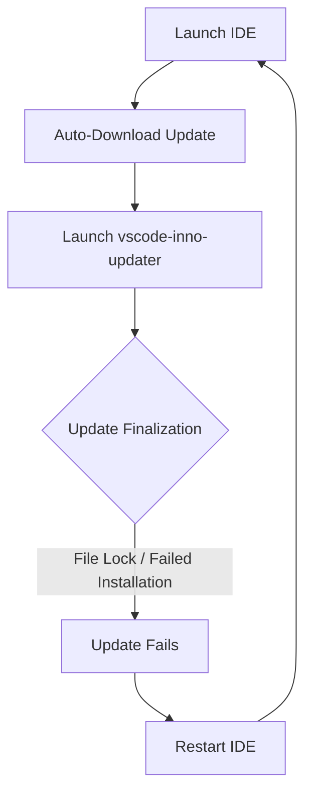

If Antigravity IDE tries to install updates every time you launch it, slows your PC during startup, asks for a restart, and then fails to complete the update, you may be stuck in an update loop.

In many cases, the IDE remains usable, but every launch triggers the updater. Windows Defender (or other antivirus software) immediately begins scanning temporary installer files, CPU and disk usage spikes, and the system becomes sluggish. When closing the IDE, the updater attempts to finalize the installation, fails, and requests a restart.

After restarting, the update still fails. On the next launch, Antigravity IDE starts the same update process again.

The result is an endless cycle:
**Launch IDE → Update Starts → System Slows Down → Restart Requested → Update Fails → Launch IDE → Repeat**

During this loop, you might encounter error dialogs such as:
*   **"Failed to install Visual Studio Code update"** (indicating that *updates may fail due to anti-virus software and/or runaway processes*)
*   **"Unable to execute file... CreateProcess failed; code 2. The system cannot find the file specified"**

This guide explains why this loop occurs and how to permanently stop it.

---

## Common Symptoms of the Update Loop

You may be affected by this issue if you observe one or more of the following:

*   Antigravity IDE downloads or installs updates on every startup.
*   CPU, memory, or disk usage spikes significantly during editor launch.
*   Windows Defender or third-party antivirus starts intensive real-time scanning activity on launch.
*   The IDE repeatedly asks for a restart to finish installing updates.
*   Updates never complete successfully, and the same version attempts to install again.
*   You encounter `CreateProcess failed: code 2` errors when trying to launch the IDE.

---

## Why This Happens: The Underlying Conflict

Antigravity IDE is built on top of VS Code and utilizes the standard VS Code update infrastructure (`vscode-inno-updater`) to apply new releases.

The update sequence typically follows this flow:



The primary issue is that the updater fails to finalize (often due to active file locks from background processes like language servers or extension hosts). Because the update never successfully completes, the IDE assumes the installation is still pending and restarts the sequence on the next boot.

The antivirus scanning and CPU spikes are a secondary effect. As the updater repeatedly launches and creates temporary installer binaries, real-time security software intercepts these files to run heuristics checks. This intensive analysis clogs disk I/O and memory, causing the workstation to freeze.

---

## What We Observed

During testing, Antigravity IDE remained functional but repeatedly attempted to apply the same update. The system became sluggish while Windows Defender inspected the temporary installer files. 

When closing the IDE, the updater attempted to finalize the installation but threw the following error:


*Figure 1: The update engine encounters a file-locking conflict during installation.*

Subsequent launches sometimes failed with directory routing errors:


*Figure 2: The system cannot find the main executable after a failed update attempt.*

The updater logs under `%TEMP%\vscode-inno-updater-*.log` confirmed that active background tasks (such as language servers) were holding locks on files, triggering access failures:

```text
Jun 03 12:38:34.908 ERRO Move: Access is denied. (os error 5), C:\Users\verti\AppData\Local\Programs\Antigravity IDE\resources -> C:\Users\verti\AppData\Local\Programs\Antigravity IDE\_\resources
```

A fresh reinstall temporarily resolved the issue, but the update loop returned once the automatic updater attempted to install a newer version.

---

## How We Restored Stability

### Fix 1: Disable Automatic Updates in Settings (Recommended)
The simplest and most reliable solution is to disable automatic update installation and switch to manual updates.

Open your user settings file:
`%APPDATA%\Antigravity IDE\User\settings.json`

Add the following configuration key:

```json
{
  "update.mode": "none"
}
```

This prevents Antigravity IDE from automatically downloading and applying updates during startup, instantly stopping the CPU spikes and restoring a fast, predictable launch.

### Fix 2: Configure Antivirus Exclusions (Optional)
If you prefer to keep automatic updates enabled, you can reduce update-related slowdowns by excluding these directories from antivirus scanning:

*   `%USERPROFILE%\AppData\Local\Programs\Antigravity IDE`
*   `%USERPROFILE%\AppData\Local\Temp`
*   `%APPDATA%\Antigravity IDE`

*Warning: Exclusions reduce real-time security inspection of those locations. Only use exclusions if you trust the software source.*

---

## Tradeoffs

### Automatic Updates Enabled
*   **Advantages**: Immediate access to new features; security patches installed automatically.
*   **Disadvantages**: Potential update loops, background installer resource spikes, antivirus scanning overhead, and unexpected restart prompts.

### Manual Updates Enabled (Recommended Workaround)
*   **Advantages**: Faster startup experience, no repeated update attempts, reduced CPU/disk activity, and predictable update scheduling.
*   **Disadvantages**: New updates must be downloaded and installed manually.

---

## When This Fix Is Appropriate

This workaround is appropriate if:
*   Antigravity IDE attempts updates repeatedly on every startup.
*   Updates consistently fail after restarting the IDE.
*   Windows Defender or CPU activity spikes significantly during editor boot.
*   You encounter recurring `CreateProcess` or file-access errors.

If automatic updates work normally on your system, there is no reason to disable them.

---

## Related Guides

If the failed update process has also corrupted your layout, caused missing workspace folders, or wiped your chat histories, see our recovery guides:

*   **[Restoring Broken Antigravity IDE Workspaces After Update Failures](/blog/antigravity-update-issue)**: Step-by-step guide to renaming the corrupt `app.asar` file and recovering your local user profiles.
*   **[Antigravity IDE Profile Migration & Settings Recovery](/blog/antigravity-update-issue#how-to-recover-lost-chat-history-settings-and-workspaces)**: Guide to migrating your extensions, settings, and themes between profile directories.
