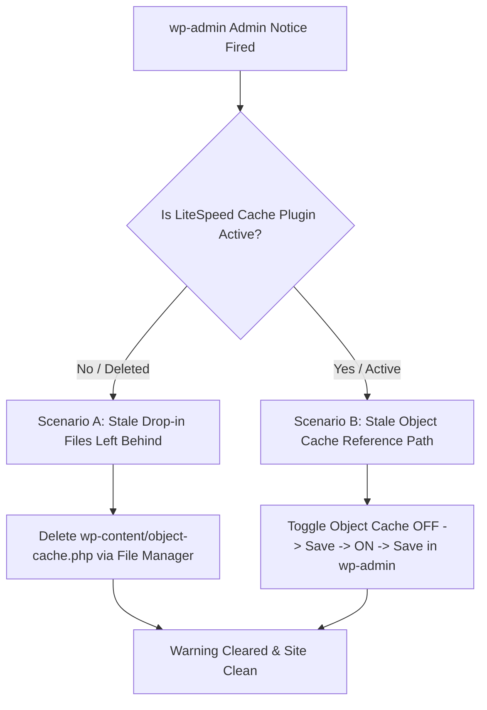

If you open `wp-admin` on a WordPress website hosted on LiteSpeed (very common on hosts like Hostinger) and see this admin notice pinned to the top of your screen:

```text
Can NOT find LSCWP path for object cache initialization in /home/uXXXXXXXXX/domains/yoursite.com/public_html/wp-content/object-cache.php
```

Do not panic. Your site is not broken, and your database is intact. This is a non-fatal warning from the LiteSpeed Cache (LSCWP) plugin indicating that its drop-in object cache handler (`object-cache.php`) cannot resolve the underlying plugin directory path.

While many generic tutorials suggest blindly deleting files or reinstalling plugins, the correct fix depends on which of **two distinct root causes** is present on your server.

---

## The Two Root Causes Behind the LSCWP Path Error

The LiteSpeed Cache plugin uses WordPress "drop-in" scripts stored directly inside the `/wp-content/` directory—specifically `object-cache.php` and `advanced-cache.php`. These drop-ins execute early in the WordPress boot sequence before standard plugins load.

When `object-cache.php` executes, it looks for the absolute path of the LSCWP plugin directory (`/wp-content/plugins/litespeed-cache/`). If that path fails to resolve, the error fires.



---

### Scenario A: LiteSpeed Cache Was Removed or Deactivated, But Drop-ins Remain

If you recently uninstalled, deactivated, or migrated away from LiteSpeed Cache, WordPress may have failed to delete the custom `object-cache.php` file from `/wp-content/`.

Because the file still exists, WordPress attempts to initialize object caching on every request, but the referenced LiteSpeed plugin code no longer exists in `/wp-content/plugins/`.

#### The Fix for Scenario A:
1. Log into your hosting control panel (such as Hostinger hPanel or cPanel) and open **File Manager** (or connect via SFTP).
2. Navigate to `public_html/wp-content/`.
3. Locate `object-cache.php` (and `advanced-cache.php` if present).
4. **Delete `object-cache.php`**. 
5. Refresh `wp-admin`. The error will immediately disappear.

---

### Scenario B: LiteSpeed Cache Is Active, But the Feature Path Is Stale

This is the most common scenario on active sites (such as custom Elementor or CoachPress builds on Hostinger). The plugin is active, page caching is working, but a background update or server path change broke the reference inside `object-cache.php`.

You do **not** need to delete files or risk breaking plugin configurations.

#### The Fix for Scenario B (30-Second Admin Fix):
1. Log into `wp-admin`.
2. Go to **LiteSpeed Cache → Cache → Object** in the sidebar.
3. Locate the **Object Cache** toggle switch.
4. Turn **Object Cache to OFF** and click **Save Changes**.
5. Turn **Object Cache back to ON** and click **Save Changes**.

<div style={{
  background: 'linear-gradient(135deg, rgba(59, 130, 246, 0.08) 0%, rgba(196, 163, 90, 0.08) 100%)',
  border: '1px solid rgba(59, 130, 246, 0.2)',
  borderRadius: '12px',
  padding: '24px 28px',
  margin: '2em 0',
  display: 'flex',
  flexDirection: 'column',
  gap: '12px'
}}>
  <div style={{ display: 'flex', alignItems: 'center', gap: '10px' }}>
    <span style={{ fontSize: '22px' }}>💡</span>
    <h3 style={{ margin: 0, fontSize: '18px', fontWeight: 'bold', color: 'var(--bt-heading)' }}>
      Why Toggling Object Cache Fixes the Problem
    </h3>
  </div>
  <p style={{ margin: 0, fontSize: '14.5px', color: 'var(--bt-text-muted)', lineHeight: '1.6' }}>
    Toggling the Object Cache setting off and on forces LiteSpeed Cache to regenerate a fresh <code>object-cache.php</code> drop-in file using your server's current dynamic file path. Your custom cache rules, CDN configurations, and optimization settings remain completely safe because they are stored separately in the WordPress database (<code>wp_options</code> table).
  </p>
</div>

---

## Why This Happens Frequently on Hostinger Hosting

If your server path contains a string like `/home/u674249501/domains/...`, your site is running on Hostinger. 

Hostinger integrates its own server-level caching layer (accessible in **hPanel → Website → Cache Manager**). When Hostinger pushes automated plugin or environment updates in the background, the server path stored in `object-cache.php` can become desynced from the active PHP runtime directory.

---

## How to Prevent Recurrence

To prevent this admin warning from returning on your client or production sites:

1. **Disable Auto-Updates for LiteSpeed Cache**: Navigate to `Plugins > Installed Plugins` and disable auto-updates specifically for LiteSpeed Cache. Update it manually during planned maintenance windows so you can verify site performance immediately.
2. **Post-Update Protocol**: Whenever you manually update LiteSpeed Cache, perform a 10-second Object Cache toggle (Off → Save → On → Save) as part of your standard post-update health check.
3. **Evaluate Object Cache Necessity**: On standard marketing or coaching sites built with Elementor, static page caching provides over 95% of performance gains. If Object Cache repeatedly causes environment conflicts on shared hosting, keeping Object Cache toggled **OFF** while retaining main LiteSpeed page caching is a recommended architectural choice.

---

## Tradeoffs & Implementation Breakdown

| Aspect | Keeping Object Cache ON | Disabling Object Cache (Page Cache Only) |
| :--- | :--- | :--- |
| **Performance Impact** | Reduces database query load for logged-in users / dynamic queries. | Minimal impact on public page load speed (LCP/TTFB unchanged). |
| **Maintenance Risk** | Potential drop-in desync after unattended server auto-updates. | Zero drop-in errors; simpler host maintenance. |
| **Ideal For** | High-traffic WooCommerce stores, membership platforms. | Coaching sites, agency portfolios, marketing landing pages. |

---

<div style={{
  background: 'linear-gradient(135deg, rgba(239, 68, 68, 0.08) 0%, rgba(196, 163, 90, 0.08) 100%)',
  border: '1px solid rgba(239, 68, 68, 0.2)',
  borderRadius: '12px',
  padding: '28px 32px',
  margin: '2.5em 0',
  boxShadow: '0 10px 30px -10px rgba(239, 68, 68, 0.15)',
  display: 'flex',
  flexDirection: 'column',
  gap: '16px',
}}>
  <div style={{ display: 'flex', alignItems: 'center', gap: '12px' }}>
    <span style={{ fontSize: '24px' }}>🛠️</span>
    <h3 style={{ margin: 0, fontSize: '19px', fontWeight: 'bold', color: 'var(--bt-heading)', fontFamily: 'var(--font-dm-sans)' }}>
      Need Help Resolving Persistent WordPress Performance or Cache Errors?
    </h3>
  </div>
  <p style={{ margin: 0, fontSize: '15px', color: 'var(--bt-text-muted)', lineHeight: '1.6' }}>
    I specialize in WordPress performance optimization, custom server architecture, and emergency troubleshooting. If your site is struggling with slow TTFB, broken cache engines, or plugin conflicts, let's get it running cleanly.
  </p>
  <div style={{ marginTop: '8px' }}>
    <a href="/?utm_source=article&utm_medium=blog&utm_campaign=litespeed-object-cache#contact" style={{
      display: 'inline-block',
      background: '#C4A35A',
      color: '#0D0D0D',
      padding: '12px 24px',
      borderRadius: '6px',
      fontWeight: 'bold',
      fontSize: '13px',
      textTransform: 'uppercase',
      letterSpacing: '0.08em',
      textDecoration: 'none',
      transition: 'all 0.3s ease',
      boxShadow: '0 4px 12px rgba(196, 163, 90, 0.25)'
    }}>
      Get a Technical Site Audit →
    </a>
  </div>
</div>

---

*Naveen Gaur is a WordPress Performance Specialist & Full-Stack Consultant helping business owners and agencies build, fix, and maintain high-performing web platforms.*
