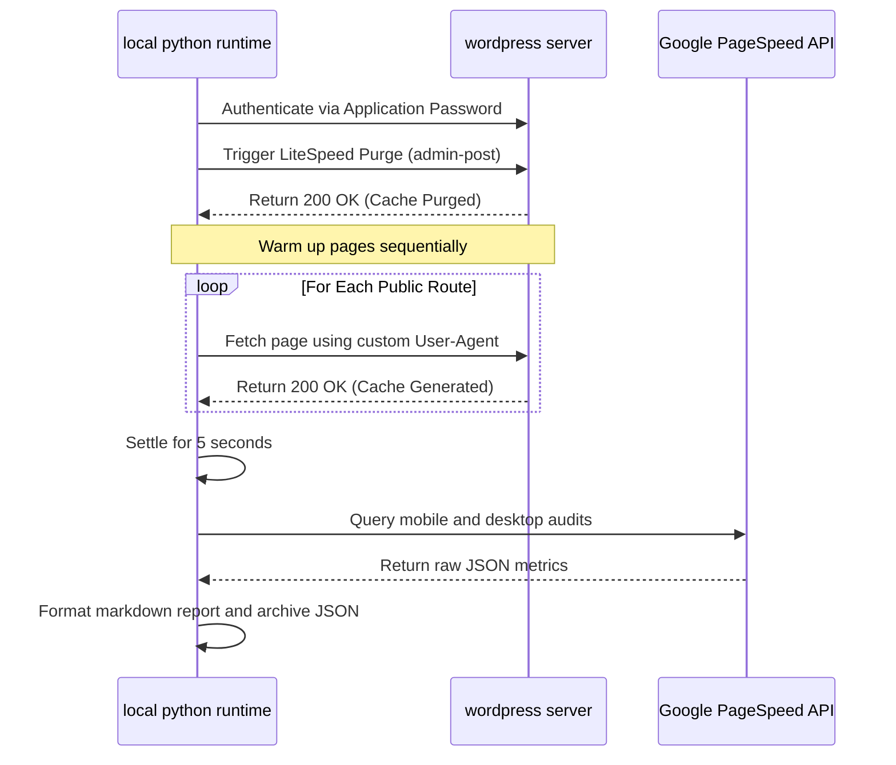

Optimizing website performance is an iterative process. Making a small change in CSS pruning or script deferral requires a repeatable workflow: purging the server cache, pre-warming the cache by visiting public pages, and running PageSpeed Insights (PSI) scans for both mobile and desktop profiles.

Doing this manually for every tiny code modification is slow and error-prone. A developer might run a PageSpeed scan before the server cache is fully generated, leading to unrepresentative scores and false regressions. To solve this, we built a unified Python command-line interface (CLI) pipeline to automate the entire cache invalidation, page warm-up, and performance verification cycle.

---

## 1. Why This Project Existed

During performance optimizations on high-traffic websites, we must constantly test configuration adjustments (such as CSS pruning and script deferral). Manually logging into the administration panel, clearing cache, visiting key routes, and loading PageSpeed Insights introduces high friction. 

To eliminate this manual testing bottleneck, we designed a pipeline that programmatically triggers cache clearing on WordPress, sequentially visits pages to warm the HTML cache, waits for asynchronous critical CSS (UCSS) generation to finish, and runs Google PageSpeed Insights tests. This creates a fast, repeatable feedback loop for development.

---

## 2. What Manual Performance Verification Was Costing

Before developing this automation pipeline, the manual optimization cycle introduced significant overhead:

- **Wasted Engineering Hours**: Purging cache via the admin panel, opening multiple public routes in separate browser tabs to pre-warm the page cache, and running Google PageSpeed Insights manually took approximately 4 to 5 minutes per iteration. Over dozens of iterations, this wasted hours of engineering time.
- **Inconsistent Cache State**: Running a performance test before the cache is warm leads to a "cache miss," which returns artificially high Largest Contentful Paint (LCP) times (often over 5 seconds) and low performance scores (in the 50s). This led to confusion about whether a performance regression was real or just a cache miss.
- **Reporting Overhead**: Manually compiling JSON reports from PageSpeed Insights and formatting them into readable summaries for stakeholders delayed communication and client reporting.

---

## 3. Business & Technical Requirements

The automation pipeline had to satisfy the following constraints:

1. **Secure API Access**: The pipeline had to authenticate with WordPress programmatically without exposing raw admin credentials or master database keys in local code.
2. **Deterministic Cache Warm-up**: The warm-up process had to visit the core conversion routes sequentially, simulating a real browser to ensure that the HTML cache, critical CSS (UCSS), and optimized WebP images were generated and cached by the web server.
3. **Automated Markdown and JSON Export**: The tool had to output a structured markdown summary for immediate business review and archive the raw JSON payloads to track performance over time.

---

## 4. Options We Evaluated

To automate performance monitoring, we evaluated three approaches:

| Criteria | Option A: Commercial SaaS Monitoring | Option B: Manual WP-CLI Scripting | Option C: Custom Integrated CLI Pipeline (Selected) |
| :--- | :--- | :--- | :--- |
| **Description** | Using a third-party service (e.g., SpeedCurve, Calibre) to track PageSpeed. | Writing local shell scripts executing commands over SSH. | A Python-based workflow engine combining WordPress REST API and Google PSI API. |
| **Implementation Effort** | Low (configuration only). | Medium (requires SSH access on all environments). | Medium (custom python scripting). |
| **Integration Depth** | Low (does not coordinate with local server cache invalidation). | Medium (only controls the server side). | High (coordinates cache purge, warm-up, and PSI triggers sequentially). |
| **Running Cost** | High ($50-$200/month per site). | Zero. | Zero (runs locally on developer machine). |

*Decision*: Option C was selected. A custom Python CLI pipeline provided the granular coordination required to purge caches, warm up routes, and run PSI tests sequentially without ongoing subscription costs.

---

## 5. The Solution

The tool is split into two subsystems coordinated by an orchestrator script (`automate_pagespeed_pipeline.py`):

1. **WordPress REST API Cache Handler**: Utilizes WordPress Application Passwords via HTTP Basic Authentication to issue administrative commands. It hits the LiteSpeed Cache administration endpoint to purge the cache and then performs GET requests to pre-warm designated routes.
2. **PageSpeed Insights API Consumer**: Connects to the Google PageSpeed Insights API, runs parallel mobile and desktop performance analyses, and parses the returned JSON metrics into structured markdown.

Here is the system workflow mapping:



---

## 6. What Broke in Production

During initial local deployment, the script failed during the cache invalidation step:

```text
HTTP/1.1 403 Forbidden
Content-Type: text/html
Date: Fri, 05 Jun 2026 12:14:02 GMT
Server: LiteSpeed
X-LiteSpeed-Cache: miss

Error: Administrative permission denied for cache purge action.
```

*The Cause*: We initially tried to trigger the LiteSpeed Cache purge by sending a GET request to the administrative URL `wp-admin/admin-post.php?action=litespeed-purge&type=all` using basic authentication. However, WordPress does not expose `admin-post.php` actions to HTTP Basic Authentication sessions out of the box, as those endpoints expect active cookie-based administrator sessions.

---

## 7. How We Restored Stability

To resolve the 403 authorization issue, we shifted from cookie-based admin-post triggers to the WordPress REST API. We configured a custom REST endpoint in the WordPress theme's `functions.php` file that hooks into `rest_api_init` and requires authorization check:

```php
add_action('rest_api_init', function () {
    register_rest_route('custom-admin/v1', '/purge-cache', array(
        'methods'             => 'POST',
        'callback'            => 'custom_purge_litespeed_cache',
        'permission_callback' => function () {
            return current_user_can('manage_options');
        }
    ));
});

function custom_purge_litespeed_cache() {
    if (class_exists('LiteSpeed_Cache_API')) {
        LiteSpeed_Cache_API::purge_all();
        return new WP_REST_Response(array('status' => 'success', 'message' => 'Cache purged'), 200);
    }
    return new WP_REST_Response(array('status' => 'error', 'message' => 'LiteSpeed active'), 500);
}
```

By registering this route, we were able to authenticate using a standard WordPress **Application Password** via HTTP Basic Authentication headers. The Python script now sends a secure POST request to `/wp-json/custom-admin/v1/purge-cache` to invalidate the cache reliably before warming up the routes.

---

## 8. The Tradeoffs of Automation

| Advantages | Disadvantages | Maintenance Overhead |
| :--- | :--- | :--- |
| **Deterministic Data**: Ensures PageSpeed is always run against a warm cache. | **Local Dependencies**: Requires Python runtimes and packages installed on the developer machine. | **API Changes**: If Google deprecates or changes the PSI API v5 schema, the JSON parser will break and need updates. |
| **Zero Cost**: Eliminates recurring subscription fees for SaaS testing tools. | **No Continuous Scheduling**: Unlike SaaS tools, it does not run on a cron trigger unless deployed to a server/CI pipeline. | **Access Keys**: Requires maintaining and rotation of PageSpeed API keys and Application Passwords. |

---

## 9. Who This Approach Is Suitable For

This pipeline is ideal for freelance developers, agencies, and technical consultants managing multiple WordPress sites who need a fast, zero-cost, and automated way to verify changes without leaving their local terminal or code editor.

---

## 10. When Not to Use This Approach

If you are managing a simple static site with no complex caching engines, or if your site does not receive enough traffic to justify performance monitoring, setting up a Python CLI script is unnecessary. Additionally, this script cannot test pages that require interactive logins or multi-step checkout procedures without adding cookie-handling capabilities.

---

## Conclusion & Consulting CTA

Automating the optimization loop allowed us to move from guessing whether server changes worked to validating them immediately with hard data. This pipeline proved critical in verifying the mobile PageSpeed jump from 56 to 98 in our [recent PageSpeed optimization case study](/blog/wordpress-pagespeed-optimization-case-study).

*Are manual performance checks slowing down your development cycles, or are you struggling to verify performance regressions? Contact Naveen today to schedule a [Technical Infrastructure & Performance Audit](https://naveengaur.com/services/technical-audit).*
